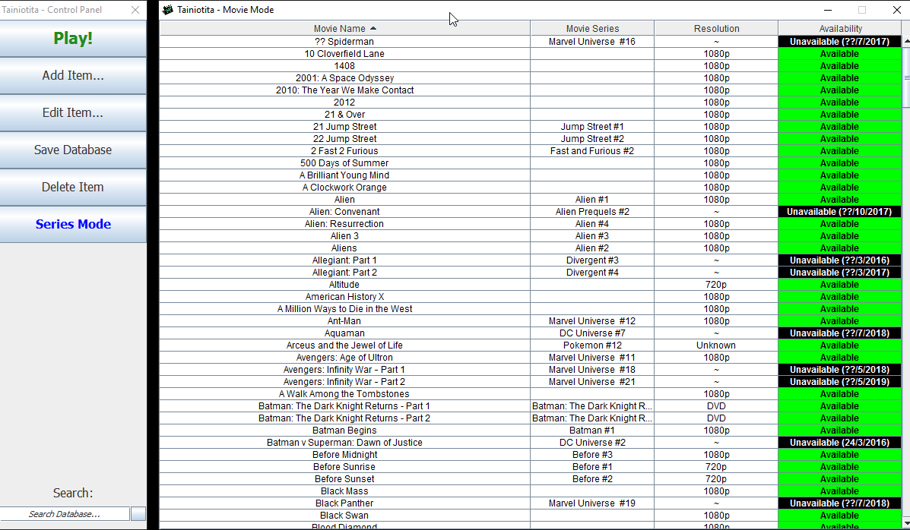
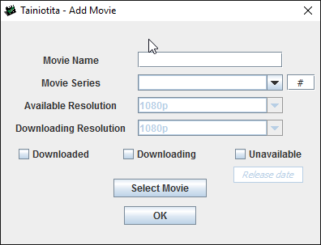
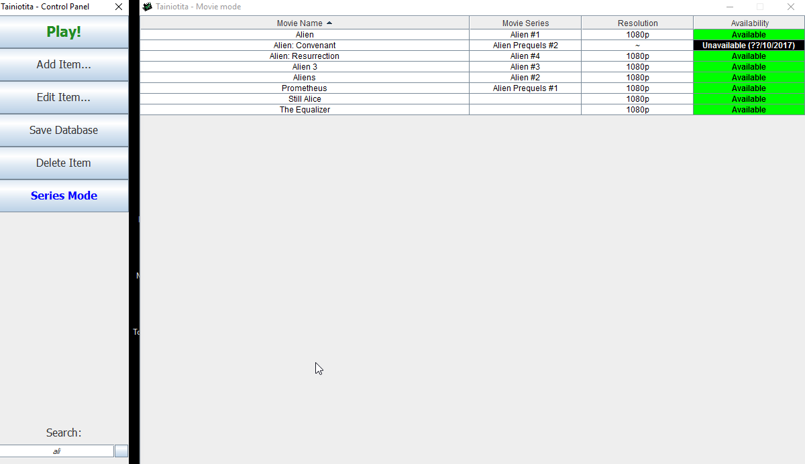
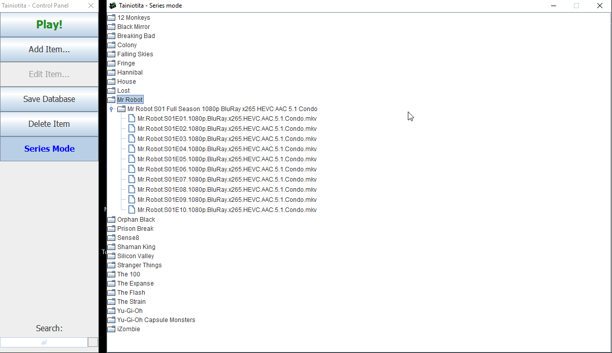

# Tainiotita
Tainiotita - A local movie database in Java

<html>

  <head>

  </head>

  <body>
  <h3>Main Program</h3>
   

 
<h3>Add movie</h3>
 

 
  <h3>Dynamic Search</h3>
   

 
  <h3>Series Mode</h3>
   

  </body>
</html>
